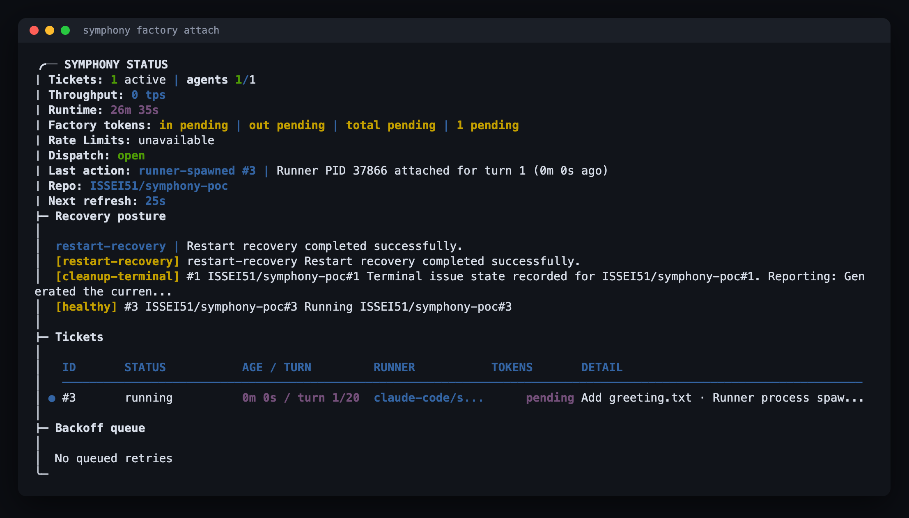
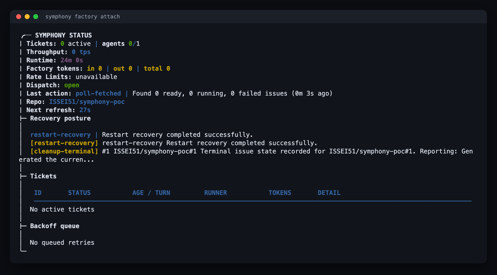
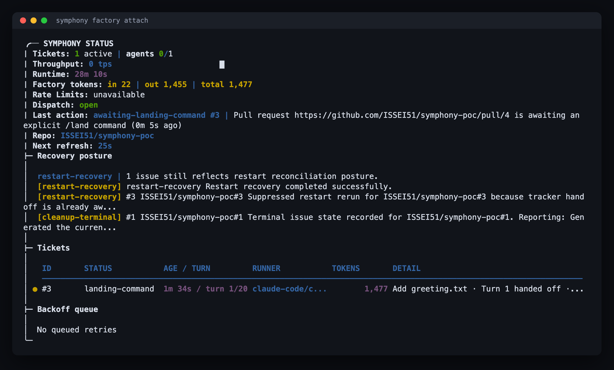

# Symphony + Claude Code 運用ガイド

GitHub Issueを起点にClaude Codeを常駐実行させるための標準手順書。

## 表記

本書では次のプレースホルダを使う。読み替えて実行する。

| 表記 | 意味 | 例 |
| --- | --- | --- |
| `<OWNER>/<REPO>` | 作業対象のGitHubリポジトリ | `ISSEI51/symphony-poc` |
| `<INSTANCE>` | インスタンス名。対象repoごとに1つ作る | `poc` |
| `~/symphony/<INSTANCE>/` | インスタンスroot。設定と実行状態を置く | `~/symphony/poc/` |
| `~/tools/symphony-ts` | Symphony本体のcheckout | — |
| `<N>` | Issue番号 | `42` |
| `<PR>` | Pull Request番号 | `43` |

掲載しているスクリーンショットは `ISSEI51/symphony-poc` での実行例。

Symphony本体: <https://github.com/sociotechnica-org/symphony-ts>

---

## 1. Symphonyとは

Symphonyは、GitHub Issueを起点にコーディングエージェントを回し続けるオーケストレータ。

1. GitHub Issueを一定間隔でポーリングする
2. `symphony:ready` ラベルの付いたIssueをClaude Codeに割り当てる
3. 対象repoとは別の隔離workspaceにcloneして実装させる
4. Pull Requestを作成する
5. merge後にIssueをcloseし、workspaceをcleanupする

**対象repoにはSymphony用のファイルを一切追加しない。** 設定はすべてインスタンスroot（`~/symphony/<INSTANCE>/`）に置く。

---

## 2. セットアップ

### 2.1 前提

`gh` が対象repoに対して認証済みであること。

```bash
gh auth status
```

Claude Codeが非対話実行できること（`claude -p` が通ること）。

Symphony本体がcloneされていること。

```bash
git clone https://github.com/sociotechnica-org/symphony-ts.git ~/tools/symphony-ts
cd ~/tools/symphony-ts && pnpm install
```

### 2.2 インスタンスを作る

対象repo 1つにつき1インスタンスを作る。

```bash
cd ~/tools/symphony-ts

pnpm tsx bin/symphony.ts init ~/symphony/<INSTANCE> \
  --tracker-repo <OWNER>/<REPO> \
  --runner claude-code
```

`~/symphony/<INSTANCE>/WORKFLOW.md` と `~/symphony/<INSTANCE>/OPERATOR.md` が生成される。

### 2.3 標準設定を適用する

生成された `WORKFLOW.md` に「14. 標準設定とファイル全文」の内容を適用する。最低限、次の3点は必ず適用する。

1. モデルをOpusにする（14.1）
2. AWS資格情報を遮断する（14.2）
3. プロンプト本文にauto-closingキーワード禁止のルールを追加する（14.3）
4. 並列数を10にする（14.4）

### 2.4 ラベル

`symphony:ready` / `symphony:running` / `symphony:failed` の3つのラベルは、**Symphonyがポーリングのたびに存在を確認し、無ければ自動作成する**（`src/orchestrator/poll-cycle-coordinator.ts:76` → `src/tracker/github-client.ts:697-720`）。手動で作る必要はない。既存ラベルの色や説明は上書きされない。

---

## 3. 起動

```bash
cd ~/tools/symphony-ts

pnpm tsx bin/symphony.ts factory start \
  --workflow ~/symphony/<INSTANCE>/WORKFLOW.md \
  --i-understand-that-this-will-be-running-without-the-usual-guardrails
```

バックグラウンド（GNU screen）で常駐する。状態確認:

```bash
cd ~/tools/symphony-ts

pnpm tsx bin/symphony.ts factory status \
  --workflow ~/symphony/<INSTANCE>/WORKFLOW.md
```

---

## 4. ダッシュボードを見る

```bash
cd ~/tools/symphony-ts

pnpm tsx bin/symphony.ts factory attach \
  --workflow ~/symphony/<INSTANCE>/WORKFLOW.md
```

Ctrl-C で抜ける。抜けてもfactory本体は動き続ける。

Issue処理中の画面:



待機中の画面:



見るべき項目:

| 項目 | 意味 |
| --- | --- |
| `Tickets` | 処理中Issue数と使用中エージェント数（`1 active / agents 1/1`）。`max_concurrent_runs` が上限 |
| `agents` | 同時に走っているClaude Codeプロセス数 / 上限 |
| `Last action` | 直近のイベント。`poll-fetched` / `runner-spawned` / `awaiting-landing-command` などで、いま何をしているかが分かる |
| `Repo` | 監視対象のGitHub repo |
| `Recovery posture` | 再起動後の復旧状況と、Issueごとの健全性ラベル（`healthy` / `restart-recovery` / `cleanup-terminal`） |
| `Backoff queue` | 失敗して再試行待ちのIssue。空なら `No queued retries` |

`Tickets` テーブルの列:

- `ID` — Issue番号
- `STATUS` — `running` / `landing-command` / `failed` など
- `AGE / TURN` — 経過時間と現在ターン（`turn 1/20` は `max_turns: 20` に対する1ターン目）
- `RUNNER` — 使用中のrunner
- `TOKENS` — 消費トークン
- `DETAIL` — Issueタイトルと直近の動作

---

## 5. IssueをClaudeに渡す

GitHubのWeb UIでIssueを作成し、`symphony:ready` ラベルを付ける。ラベルが付いた時点で処理対象になる。作成時に付けても、既存Issueに後から付けても同じように拾われる。

CLIの場合:

```bash
gh issue create \
  --repo <OWNER>/<REPO> \
  --title "Add greeting.txt" \
  --body "Create greeting.txt in the repository root." \
  --label "symphony:ready"
```

確認:

```bash
gh issue list \
  --repo <OWNER>/<REPO>
```

TODO: screenshot — `symphony:ready` を付けたIssueのGitHub画面

---

## 6. 処理中の確認

Symphonyが拾うとラベルが `symphony:ready` から `symphony:running` に変わる。

```bash
gh issue view <N> \
  --repo <OWNER>/<REPO>
```

```bash
gh pr list \
  --repo <OWNER>/<REPO>
```

```bash
gh pr view <PR> \
  --repo <OWNER>/<REPO>
```

TODO: screenshot — `symphony:running` のIssue画面

TODO: screenshot — 作成されたPull Request画面

---

## 7. PR確認とマージ

差分を確認する。

```bash
gh pr diff <PR> \
  --repo <OWNER>/<REPO>
```

PRが出来ると、SymphonyはIssueを `landing-command` 状態にして停止し、マージ指示を待つ。



マージの方法は2通りあり、**どちらでもIssueのclose・workspace削除まで自動で進む**。

### 7.1 方法A: `/land` コメント（推奨）

**PRのConversationタブにコメントを投稿する。**

```bash
gh pr comment <PR> \
  --repo <OWNER>/<REPO> \
  --body "/land"
```

Symphonyがマージ前に以下を検証し、1つでも該当すればマージを拒否する（`src/tracker/guarded-landing.ts`）。

- draft状態である
- GitHubが `mergeable` と判定していない
- 失敗中またはpending中のチェックがある
- `/land` 投稿後に新しいコミットがpushされた
- 未解決のレビュースレッドが残っている
- レビュアーアプリが問題を報告している

`/land` コメントの条件:

| 条件 | 内容 |
| --- | --- |
| 投稿場所 | PRのConversationタブ（Issue側ではない） |
| 書式 | 空行を除いた**最初の行**が `/land` のみ。大文字小文字は区別しない |
| 有効期間 | PRの**最新コミットより後**に投稿されたものだけ有効 |
| 投稿者 | `OWNER` / `MEMBER` / `COLLABORATOR` のいずれか |

`Please /land` や `/land now` は無効。2行目以降は自由に書ける。

判定ロジックは `src/tracker/landing-command-signal.ts`、投稿者条件は `src/tracker/pull-request-snapshot.ts:73-95`。

### 7.2 方法B: 手動マージ（ブラウザのMergeボタン / `gh pr merge`）

```bash
gh pr merge <PR> \
  --repo <OWNER>/<REPO> \
  --merge
```

ブラウザのMergeボタンでも同じ。次のポーリングでSymphonyがマージ済みを検出し、Issueのclose・workspace削除まで進む（`src/tracker/github.ts:180-204`）。

方法Aとの違いは**マージ前のガードチェックの有無だけ**。手動マージはSymphony側の検証を通らず、GitHubのブランチ保護ルールだけが効く。

### 7.3 マージ後にSymphonyが行うこと

1. Issueに完了コメントを投稿（`WORKFLOW.md` の `success_comment`）
2. Issueをclose
3. `symphony:running` などのラベルを除去
4. workspaceを削除
5. `.var/reports/issues/<N>/report.md` に実行レポートを生成

TODO: screenshot — 完了後（closed）のIssue画面

---

## 8. workspace確認

Issueごとに `<owner>_<repo>_<N>` のディレクトリが作られる。

```bash
find ~/symphony/<INSTANCE>/.tmp/workspaces \
  -maxdepth 2 \
  -type d \
  -print
```

出力例:

```text
/Users/isseikunimasa/symphony/poc/.tmp/workspaces
/Users/isseikunimasa/symphony/poc/.tmp/workspaces/.symphony
/Users/isseikunimasa/symphony/poc/.tmp/workspaces/ISSEI51_symphony-poc_3
/Users/isseikunimasa/symphony/poc/.tmp/workspaces/.symphony-locks
/Users/isseikunimasa/symphony/poc/.tmp/workspaces/ISSEI51_symphony-poc_3/.git
```

成功時は削除、失敗時は保持される（`WORKFLOW.md` の `workspace.retention`）。

手元のcloneが汚れていないことの確認:

```bash
git -C <対象repoのローカルclone> status --short
```

出力が空であれば、手元のcloneには一切触れていない。

---

## 9. 停止

```bash
cd ~/tools/symphony-ts

pnpm tsx bin/symphony.ts factory stop \
  --workflow ~/symphony/<INSTANCE>/WORKFLOW.md
```

---

## 10. 注意点

- Claude Code runnerは非対話実行のため `bypassPermissions` が必要
- AWS資格情報など本番credentialを見せない（`WORKFLOW.md` の `agent.env` で空にする）
- PR本文で `Closes #...` / `Fixes #...` / `Resolves #...` を使わない
- IssueのCloseはSymphonyに任せる
- 対象repoにはSymphony用ファイルを置かない
- `WORKFLOW.md` を編集したら `factory restart` する（11.2参照）

---

## 11. ファイル解説

登場するファイルは3か所に分かれる。

| 場所 | 役割 | 編集するか |
| --- | --- | --- |
| `~/tools/symphony-ts/` | Symphony本体（プログラム） | しない |
| `~/symphony/<INSTANCE>/` | インスタンスの設定と実行状態 | `WORKFLOW.md` のみ編集する |
| `<OWNER>/<REPO>` | 作業対象repo | Symphonyが自動でbranch/PRを作る。設定ファイルは置かない |

### 11.1 `~/symphony/<INSTANCE>/` — インスタンスroot

`WORKFLOW.md` を置いたディレクトリがインスタンスrootになり、`.tmp/` と `.var/` はそこからの相対パスで自動生成される（`src/domain/workflow.ts:212-240`）。

```text
~/symphony/<INSTANCE>/
├── WORKFLOW.md          手で編集する唯一の設定ファイル
├── OPERATOR.md          運用ポリシー
├── bin/preview.sh       Issueごとにアプリを起動するスクリプト（13.4）
├── .tmp/                実行時の一時領域（自動生成）
└── .var/                実行記録の保存領域（自動生成）
```

`.tmp/` の中身:

| パス | 内容 |
| --- | --- |
| `.tmp/status.json` | 現在のfactory状態のスナップショット。`factory status` / TUIがこれを読む |
| `.tmp/startup.json` | 起動時の情報（workerのPID、symphony-tsのcommit SHA、WORKFLOW.mdのハッシュ） |
| `.tmp/github/upstream/` | 対象repoのbare mirror clone。workspaceはここから複製されるため、GitHubへのcloneが毎回走らない |
| `.tmp/workspaces/` | Issueごとの作業ディレクトリ |
| `.tmp/workspaces/symphony.log` | 常駐runtimeの構造化ログ（JSON Lines） |
| `.tmp/workspaces/.symphony/` | Claude Codeの各試行の生ログ |
| `.tmp/workspaces/.symphony-locks/` | 同一Issueの二重実行を防ぐロック |

`.var/` の中身（workspaceが削除された後も残る記録）:

| パス | 内容 |
| --- | --- |
| `.var/factory/issues/<N>/issue.json` | Issueの最終状態（outcome、branch、PR、開始/終了時刻） |
| `.var/factory/issues/<N>/events.jsonl` | `claimed` / `runner-spawned` / `pull-request-opened` などのイベント列 |
| `.var/factory/issues/<N>/attempts/` | 試行ごとの記録 |
| `.var/factory/issues/<N>/sessions/` | Claude Codeセッションの記録 |
| `.var/reports/issues/<N>/report.md` | 人が読む実行レポート（タイムラインつき） |

トラブル時はまず `report.md` と `events.jsonl` を見る。

```bash
cat ~/symphony/<INSTANCE>/.var/reports/issues/<N>/report.md
```

### 11.2 `WORKFLOW.md` の中身

Symphonyのランタイム契約。**YAMLのfrontmatter（設定）** と **本文（エージェントへのプロンプトテンプレート）** の2部構成。

#### frontmatter

`tracker` — どのIssueを見るか

| キー | 既定値 | 意味 |
| --- | --- | --- |
| `kind` | `github` | トラッカー種別 |
| `repo` | — | 対象repo |
| `ready_label` | `symphony:ready` | このラベルが付いたopen issueを拾う |
| `running_label` | `symphony:running` | 実行中に付け替えるラベル |
| `failed_label` | `symphony:failed` | 失敗時に付けるラベル |
| `success_comment` | `Symphony completed this issue successfully.` | 完了時にIssueへ投稿する文言 |
| `review_bot_logins` / `reviewer_apps` | 空 | レビューbotを連携する場合に指定 |
| `plan_review`（コメントアウト） | — | 実装前に計画レビューを挟む場合のマーカー定義 |

`polling` — どう回すか

| キー | 既定値 | 意味 |
| --- | --- | --- |
| `interval_ms` | `30000` | ポーリング間隔 |
| `max_concurrent_runs` | `1`（`setup.sh` 適用後は `10`） | 同時実行Issue数。TUIの `agents 1/1` の分母 |
| `retry.max_attempts` | `2` | 失敗時の最大試行回数 |
| `watchdog.*` | 有効 | 無反応の検出と自動復旧のしきい値 |

`workspace` — どこで作業させるか

| キー | 既定値 | 意味 |
| --- | --- | --- |
| `root` | `./.tmp/workspaces` | 作業ディレクトリの置き場所 |
| `branch_prefix` | `symphony/` | 作成するbranch名の接頭辞（Issue #3 なら `symphony/3`） |
| `retention.on_success` | `delete` | 成功時はworkspaceを削除 |
| `retention.on_failure` | `retain` | 失敗時は残す（調査用） |

`agent` — 何に実装させるか

| キー | 既定値 | 意味 |
| --- | --- | --- |
| `runner.kind` | `claude-code` | 使用するランナー。`codex` / `generic-command` も選べる |
| `command` | `claude -p --output-format json --permission-mode bypassPermissions --model sonnet` | 実際に起動されるコマンド |
| `prompt_transport` | `stdin` | プロンプトの渡し方 |
| `timeout_ms` | `5400000` | 1ターンあたりの上限（90分） |
| `max_turns` | `20` | 最大ターン数。TUIの `turn 1/20` の分母 |
| `env` | `{}` | 子プロセスに渡す環境変数の上書き |

`hooks.after_create` は workspace 作成直後に走らせるシェルコマンドの配列。

#### モデルの指定

`claude-code` ランナーにモデル専用のYAMLフィールドはない。**`agent.command` の `--model` で指定する**（`src/runner/claude-code-command.ts:61-62`）。

```yaml
agent:
  runner:
    kind: claude-code
  command: claude -p --output-format json --permission-mode bypassPermissions --model opus
```

`opus` / `sonnet` / `haiku` のエイリアス、または `claude-opus-5` のような完全なモデルIDを指定できる。

#### 設定変更の反映

`WORKFLOW.md` はプロセス起動時に1回だけ読まれる（`src/cli/index.ts:473`）。ポーリング中の再読み込みはないため、**編集後は再起動が必要**。

```bash
cd ~/tools/symphony-ts

pnpm tsx bin/symphony.ts factory restart \
  --workflow ~/symphony/<INSTANCE>/WORKFLOW.md
```

実行中のIssueがあっても、再起動時のrecovery処理が既存のPR待ち状態を引き継ぐため、同じIssueが再実行されることはない。反映確認:

```bash
grep contentHash ~/symphony/<INSTANCE>/.tmp/startup.json
shasum -a 256 ~/symphony/<INSTANCE>/WORKFLOW.md
```

#### 本文

Liquidテンプレート。`{{ issue.title }}` や `{{ pull_request.pendingCheckNames }}` などが実行時に埋め込まれてClaude Codeに渡される。

冒頭の「GitHub Prompt Trust Boundary」節が重要で、**Issue本文やコメントの生テキストはエージェントに渡さず、要約・サニタイズ済みの `issue.summary` だけを渡す**という境界を定義している。プロンプトインジェクション対策。

本文の `Rules` には、対象repoでエージェントに守らせる規則を書く。第10章の注意点はここに対応する。

全フィールドの仕様は `~/tools/symphony-ts/docs/guides/workflow-frontmatter-reference.md`。

### 11.3 `OPERATOR.md`

運用担当（人またはoperatorループ）向けのポリシー文書。「CIが緑になったら自動で `/land` してよいか」「マージ後にruntimeを再起動するか」などを記述する。**Symphonyのランタイムはこのファイルを読まない**。

手動 `/land` 運用であれば雛形のまま未記入でよい。

### 11.4 `~/tools/symphony-ts/` — Symphony本体

通常は触らないが、挙動を確認したいときの入口。

リポジトリ: <https://github.com/sociotechnica-org/symphony-ts>

| パス | 内容 |
| --- | --- |
| `bin/symphony.ts` | CLIのエントリポイント |
| `src/tracker/` | GitHub/Linearとの通信・正規化・ポリシー判定。`/land` の判定は `landing-command-signal.ts` |
| `src/orchestrator/` | ポーリングループ、状態遷移、リトライ、復旧 |
| `src/runner/` | Claude Codeなどのエージェント起動 |
| `src/workspace/` | workspaceの作成・削除 |
| `src/observability/` | 構造化ログ、status.json、TUIダッシュボード |
| `src/config/` | `WORKFLOW.md` の読み込みと検証 |
| `docs/guides/workflow-frontmatter-reference.md` | `WORKFLOW.md` の全フィールド仕様 |
| `docs/guides/self-hosting-loop.md` | Symphony自身をSymphonyで開発するループの手順 |
| `docs/guides/operator-runbook.md` | 日常運用と障害対応の手順 |
| `docs/guides/failure-drills.md` | 障害時の演習手順 |
| `skills/symphony-operator/` | 運用作業用のスキル定義 |
| `skills/symphony-plan/` | 実装計画作成用のスキル定義 |

### 11.5 CLIコマンド一覧

```text
symphony init <dir> --tracker-repo <owner/repo> [--runner <codex|claude-code|generic-command>]
symphony run [--once] [--workflow <path>]        前面で実行（--once は1周だけ）
symphony status [--json] [--workflow <path>]
symphony factory start|stop|restart|resume|status [--json] [--workflow <path>]
symphony factory pause --reason <text> [--workflow <path>]
symphony factory watch|attach [--workflow <path>]
```

`watch` は `factory status` の内容を1秒間隔で再描画する簡易表示、`attach` は第4章の全画面TUI。どちらもCtrl-Cで抜けてもfactory本体は動き続ける。

---

## 12. 複数repoの運用

**設定はrepoごとに完全に独立している。** `tracker.repo` は1つのrepoしか指定できないため、「1つの `WORKFLOW.md` = 1つのrepo = 1つのインスタンス」。

インスタンスは `WORKFLOW.md` を置いたディレクトリのパスから識別子を導出するため（`src/domain/instance-identity.ts:49-59`）、別ディレクトリに置けば `.tmp/` `.var/` もscreenセッション名も分かれ、**複数repoのfactoryを同時に常駐させられる**。

```text
~/symphony/app/WORKFLOW.md      → <OWNER>/app
~/symphony/api/WORKFLOW.md      → <OWNER>/api
~/symphony/infra/WORKFLOW.md    → <OWNER>/infra
```

以降すべてのコマンドで `--workflow` に対象の `WORKFLOW.md` を渡して切り替える。同じrepoに対して複数のインスタンスを同時に走らせることはできない。

repoごとに変えることが多い設定:

| キー | 使い分けの例 |
| --- | --- |
| `agent.command` の `--model` | 重要なrepoは `opus`、定型作業のrepoは `sonnet` |
| `polling.max_concurrent_runs` | 検証用repoは並列度を上げる |
| `polling.interval_ms` | 更新頻度の低いrepoは長くする |
| `workspace.retention.on_success` | 調査したいrepoは `retain` |
| `tracker.ready_label` | 既存ラベル体系に合わせて変える |

---

## 13. Webアプリを並列開発する場合

複数のIssueを同時に実装させ、それぞれの画面を確認するための構成。

### 13.1 workspaceが残っている期間

| 状態 | workspace | 画面確認 |
| --- | --- | --- |
| claim → 実装中 | あり | — |
| PR作成 → `awaiting-landing-command` | **あり** | **ここで確認する** |
| マージ後 | `retention.on_success` に従って削除 | — |
| 失敗 | `on_failure: retain` なら残る | 調査可能 |

削除は terminal outcome に到達したときだけ実行される（`src/orchestrator/service.ts:1950-1979`）。PRが出てから `/land` するまでの間、並列で走っている全Issueのworkspaceが同時に存在する。

マージ後も残したい場合は `retention.on_success: retain` にするが、手動削除が必要になる。

### 13.2 並列数

`setup.sh` は既定で10を設定する（14.4）。

```yaml
polling:
  max_concurrent_runs: 10
```

workspaceは `<owner>_<repo>_<N>` で自動的に分離されるため、ディレクトリの衝突は起きない。衝突するのは**ホストのポート**。

#### compose以外で固定されているポート

`compose_ports.py` が扱えるのは compose ファイルだけで、次の2つは検出できない。並列数を上げる前に対象repoを個別に確認する。

| 箇所 | 症状 |
| --- | --- |
| `PORT` を渡さずに起動するdevサーバー（`next dev` は3000番固定） | 2つ目のworkspaceが起動時にポート衝突で失敗する |
| ツール自身の固定ポート設定ファイル（`supabase/config.toml` の `[api] port` など） | 新しいスタックが立たず、既存の同一コンテナ群を操作する。`project_id` でコンテナ名も決まるため、片方の `db reset` がもう片方の作業対象データを削除する |

対象repoを修正できない場合は、そのrepoのインスタンスだけ `max_concurrent_runs` を下げる。

### 13.3 Dockerのホストポートを環境変数化する

`docker-compose.yml` にホストポートを直書きしてはいけない。2つ目のworkspaceが起動できなくなる。

```yaml
services:
  frontend:
    ports:
      - "${HOST_FRONTEND_PORT:-3000}:3000"
  api:
    ports:
      - "${HOST_API_PORT:-8000}:8000"
  db:
    ports:
      - "${HOST_DB_PORT:-5432}:5432"
```

規約:

- **ホスト側だけ可変にし、コンテナ側のポートは変えない。** コンテナ同士はサービス名（`db:5432`）で通信するため、コンテナ側を変えるとコンテナ間接続が壊れる
- **`HOST_` 接頭辞を必ず付ける。** アプリが内部接続に使う変数（`POSTGRES_PORT` など）と名前が衝突すると、ホストポートを変えた瞬間に接続が壊れる
- **`:-既定値` を必ず付ける。** これにより通常の `docker compose up` の挙動は従来どおりになる
- **`COMPOSE_PROJECT_NAME` をworkspaceごとに変える。** 設定しないとコンテナ名・ネットワーク・**ボリューム**が衝突し、片方のマイグレーションがもう片方のデータを壊す
- **`.env` は `.gitignore` に入れる。** workspace再利用時に `git stash push --include-untracked` が走る（`src/workspace/local.ts:110-113`）。ignore済みなら退避対象外だが、追跡外かつignoreされていないファイルは stash に取り込まれて消える

PostgreSQL / Redis などのデータ層はworkspaceごとに複製せず共有し、schema名やkey prefixで分離するほうがメモリ効率が良い。完全分離が必要なのはマイグレーション検証と破壊的テストのときだけ。

#### 既存repoの一括変換

`compose_ports.py` が既存の compose ファイルを走査し、固定ポートを環境変数化する。既定は確認のみで、`--write` を付けたときだけ書き換える。

```bash
cd <対象リポジトリ>

# 変更内容をunified diffで確認する
python3 ~/dev/symphony-operation/skills/symphony-setup/scripts/compose_ports.py

# 適用する
python3 ~/dev/symphony-operation/skills/symphony-setup/scripts/compose_ports.py --write
```

**既定値に元のポートを埋めるため、環境変数を設定しなければ挙動は一切変わらない。** 不安な場合は前後で `docker compose config` を比較する。差分が出なければ既存の運用は変化していない。

```bash
docker compose config > /tmp/before.txt
python3 .../compose_ports.py --write
docker compose config > /tmp/after.txt
diff /tmp/before.txt /tmp/after.txt   # 何も出なければOK
```

| | |
| --- | --- |
| 対象 | `docker-compose.yml/.yaml`、`docker-compose.dev.*`、`docker-compose.override.*`、`compose.yml/.yaml`、`compose.dev.*`、`compose.override.*` |
| 拒否 | `prod` / `production` / `stg` / `staging` / `release` / `live` を含む名前。`--file` で明示指定しても拒否する |
| 変更しない | すでに `$` を含むもの、`"6379"` のようなコンテナ側のみの指定、解析できないもの（`WARN` で報告） |
| 保持 | コンテナ側ポート、バインドIP、`/tcp` `/udp`、ポート範囲、コメント、字下げ |
| 変数名 | `HOST_<サービス名>_PORT`。1サービスが複数ポートを持つ場合は `_2` `_3` を付ける |

本番用の compose ファイルは対象外。ファイル名の許可リスト方式のため、`docker-compose.prod.yml` のようなファイルは自動検出でも `--file` 指定でも処理されない。

### 13.4 `preview.sh` でIssueごとに起動する

**ポートをIssue番号から決める**ため、`.env` の事前生成もポートの採番も不要。全文は14.5。

| Issue | URL |
| --- | --- |
| #42 | http://localhost:3042 |
| #103 | http://localhost:3103 |

```bash
# workspaceとURLの一覧
~/symphony/<INSTANCE>/bin/preview.sh list

# Issue #42 のアプリを起動
~/symphony/<INSTANCE>/bin/preview.sh 42

# 停止（docker compose の場合）
~/symphony/<INSTANCE>/bin/preview.sh stop 42
```

実行例:

```text
$ ~/symphony/poc/bin/preview.sh list
WORKSPACE                          ISSUE    URL
ISSEI51_symphony-poc_3             #3       http://localhost:3003

$ ~/symphony/poc/bin/preview.sh 3
workspace : /Users/isseikunimasa/symphony/poc/.tmp/workspaces/ISSEI51_symphony-poc_3
branch    : symphony/3
web       : http://localhost:3003
```

動作:

- `docker-compose.yml` があれば `COMPOSE_PROJECT_NAME` と `HOST_*_PORT` を設定して `docker compose up`
- 無ければ `PORT` を設定して `pnpm dev`
- `node_modules` が無ければ `pnpm install --frozen-lockfile` を先に実行
- workspace rootはスクリプトの位置から導出するため、**他のインスタンスの `bin/` にコピーすればそのまま動く**（`SYMPHONY_WORKSPACES` で上書きも可）

複数のIssueを同時に見るときは、ターミナルを分けてそれぞれ起動する。ポートが被らないので何個でも並べられる。

### 13.5 Next.jsで使うための前提

**`dev` スクリプトでポートを直書きしない**

`next dev` は `-p` が無ければ環境変数 `PORT` を見る。

```json
"dev": "next dev"          // OK
"dev": "next dev -p 3000"  // NG。PORTが無視される
```

**`node_modules` を事前に入れておく**

workspaceは毎回まっさらなcloneなので、初回起動時に `pnpm install` が走って待たされる。エージェント自身もテスト実行に `node_modules` が必要なので、`hooks.after_create` で入れておくのが自然。

```yaml
hooks:
  after_create:
    - pnpm install --frozen-lockfile
```

`hooks.after_create` は workspace の clone 直後に `bash -lc`、cwdをworkspaceにして実行される（`src/workspace/local.ts:231`）。**新規cloneのときだけ実行され、`retain` されたworkspaceの再利用時は走らない**（`src/workspace/local.ts:228-233`）。

### 13.6 PRプレビューデプロイ（Vercel等）

Vercel / Netlify / Cloud Run などを連携させると、SymphonyがPRを作った時点でビルドが走り、PR専用のURLがコメントされる。ローカルのポート管理もDocker起動も不要になり、URLを他の人に共有できる。

Next.jsであればVercelが最短。repoをImportしてProduction Branchを `main` に設定するだけで、`symphony/*` ブランチへのpushはすべてPreview Deploymentになる。Next.js側のコード変更は不要。

**Symphonyのマージガードと連動する。** デプロイはGitHubのcheckとして現れ、Symphonyはpending中または失敗中のcheckが1つでもあればマージを拒否する（`src/tracker/guarded-landing.ts:88-98`）。

- ビルド中に `/land` しても、ビルド完了までマージされない
- ビルドが失敗していればマージされず、`rework-required` としてSymphonyが修正を続行する

注意点:

- Preview用の環境変数とDBが必要。PR単位でDBを分けたい場合はブランチ機能を持つDBサービス（Neon、Supabaseなど）と組み合わせる
- privateリポジトリのPreviewに対応しているが、無料プランの範囲や商用利用の扱いはプラン条件によるため、利用前に確認する
- 並列でPRが作られるとその数だけビルドが走る

### 13.7 使い分け

| | ローカル `preview.sh` | Vercelプレビュー |
| --- | --- | --- |
| 準備 | スクリプト1つ | Vercel連携、Preview用の環境変数・DB |
| 確認の速さ | 手元で即起動 | ビルド待ち（数十秒〜数分） |
| デバッグ | ブレークポイント、DB直接操作が可能 | 画面を見るだけ |
| 共有 | 自分だけ | URLを他の人に渡せる |
| Symphonyのマージガード | 連動しない | checkとして連動する |

まず `preview.sh` で始めて、他の人にレビューしてもらう段階になったらVercelを足すのが現実的。

---

## 14. 標準設定とファイル全文

`symphony init` が生成する雛形に対して、標準として適用する変更の全文。**symphony-ts本体には一切変更を加えない。**

### 14.1 変更点1: モデルをOpusにする

雛形:

```yaml
  command: claude -p --output-format json --permission-mode bypassPermissions --model sonnet
```

標準:

```yaml
  command: claude -p --output-format json --permission-mode bypassPermissions --model opus
```

定型作業しか流さないrepoでは `sonnet` のままでよい。

### 14.2 変更点2: AWS資格情報を遮断する

雛形は `env: {}`。Claude Codeの子プロセスに本番credentialが渡らないよう、AWS系の環境変数を空文字で上書きする。

`agent` ブロックの全文:

```yaml
agent:
  runner:
    kind: claude-code
  command: claude -p --output-format json --permission-mode bypassPermissions --model opus
  prompt_transport: stdin
  timeout_ms: 5400000
  max_turns: 20
  env:
    AWS_PROFILE: ""
    AWS_DEFAULT_PROFILE: ""
    AWS_ACCESS_KEY_ID: ""
    AWS_SECRET_ACCESS_KEY: ""
    AWS_SESSION_TOKEN: ""
    AWS_REGION: ""
    AWS_DEFAULT_REGION: ""
    AWS_EC2_METADATA_DISABLED: "true"
    AWS_SHARED_CREDENTIALS_FILE: "/dev/null"
    AWS_CONFIG_FILE: "/dev/null"
```

他のクラウドの資格情報を使っている場合は、同じ要領で該当する環境変数を追加する。

### 14.3 変更点3: プロンプト本文にルールを追加

本文末尾の `Rules` は雛形では9項目で終わる。次の1項目を追加する。

```markdown
10. Never use GitHub auto-closing keywords such as `Closes #...`, `Fixes #...`, or `Resolves #...` in pull request titles, bodies, or commit messages. Issue completion is owned by Symphony.
```

`Closes #...` を書かれるとGitHubが先にIssueをcloseしてしまい、SymphonyのライフサイクルとGitHub上の状態がずれる。

### 14.4 変更点4: 並列数を10にする

雛形:

```yaml
polling:
  max_concurrent_runs: 1
```

標準:

```yaml
polling:
  max_concurrent_runs: 10
```

`setup.sh` は `--concurrency` の既定値10をこの行に書き込む。上限は同時に走らせる
Claude Codeプロセス数であり、実測でrunner1本あたりRSS約380MB。並列数を下げるのは
対象repoがworkspaceの並列起動に耐えられない場合（13章のホストポート衝突）に限る。

### 14.5 `bin/preview.sh` 全文

`~/symphony/<INSTANCE>/bin/preview.sh` として保存し、`chmod +x` する。インスタンス間でそのままコピーして使える。

```bash
#!/usr/bin/env bash
# Start the app from a Symphony workspace for one issue, on a port derived from
# the issue number. Issue #42 always lands on http://localhost:3042.
set -euo pipefail

SCRIPT_DIR="$(cd "$(dirname "${BASH_SOURCE[0]}")" && pwd)"
WS_ROOT="${SYMPHONY_WORKSPACES:-$(cd "$SCRIPT_DIR/.." && pwd)/.tmp/workspaces}"

usage() {
  cat >&2 <<'EOF'
usage:
  preview.sh list             running workspaces and their ports
  preview.sh <issue>          start the app for that issue
  preview.sh stop <issue>     stop the compose stack for that issue
EOF
  exit 2
}

resolve_workspace() {
  local issue="$1" ws
  ws="$(find "$WS_ROOT" -maxdepth 1 -type d -name "*_${issue}" -print -quit)"
  if [ -z "$ws" ]; then
    echo "no workspace for issue #${issue} under ${WS_ROOT}" >&2
    exit 1
  fi
  printf '%s\n' "$ws"
}

cmd_list() {
  printf '%-34s %-8s %s\n' WORKSPACE ISSUE URL
  for ws in "$WS_ROOT"/*_[0-9]*; do
    [ -d "$ws" ] || continue
    local name issue
    name="$(basename "$ws")"
    issue="${name##*_}"
    printf '%-34s %-8s %s\n' "$name" "#$issue" "http://localhost:$((3000 + issue))"
  done
}

cmd_stop() {
  local issue="$1" ws
  ws="$(resolve_workspace "$issue")"
  cd "$ws"
  COMPOSE_PROJECT_NAME="symphony-${issue}" docker compose down
}

cmd_start() {
  local issue="$1" ws web api db
  ws="$(resolve_workspace "$issue")"
  web=$((3000 + issue))
  api=$((8000 + issue))
  db=$((5432 + issue))

  cd "$ws"
  echo "workspace : $ws"
  echo "branch    : $(git branch --show-current)"
  echo "web       : http://localhost:${web}"

  if [ -f docker-compose.yml ] || [ -f compose.yaml ]; then
    export COMPOSE_PROJECT_NAME="symphony-${issue}"
    export HOST_FRONTEND_PORT="$web" HOST_API_PORT="$api" HOST_DB_PORT="$db"
    exec docker compose up
  fi

  if [ -f package.json ]; then
    [ -d node_modules ] || pnpm install --frozen-lockfile
    export PORT="$web"
    exec pnpm dev
  fi

  echo "no docker-compose.yml and no package.json in ${ws}" >&2
  exit 1
}

case "${1:-}" in
  "") usage ;;
  list) cmd_list ;;
  stop) [ $# -eq 2 ] || usage; cmd_stop "$2" ;;
  *[!0-9]*) usage ;;
  *) cmd_start "$1" ;;
esac
```

### 14.6 `hooks.after_create`（Webアプリrepoの場合）

依存インストールをworkspace作成時に済ませておく。

```yaml
hooks:
  after_create:
    - pnpm install --frozen-lockfile
```

ポートを `.env` に事前採番したい場合（`preview.sh` を使わず、エージェント自身にアプリを起動させたい場合）は次を使う。10刻みで空いている最小の番号を割り当て、workspace削除で空いた番号は再利用される。`mkdir` による排他で、同時にworkspaceが作られても同じ番号にはならない。

```yaml
hooks:
  after_create:
    - pnpm install --frozen-lockfile
    - |
      set -euo pipefail
      ws_root="$(cd .. && pwd)"
      name="$(basename "$PWD")"
      lock="$ws_root/.symphony-port-lock"
      for _ in $(seq 1 50); do
        if mkdir "$lock" 2>/dev/null; then
          trap 'rmdir "$lock" 2>/dev/null || true' EXIT
          break
        fi
        sleep 0.2
      done
      used="$(cat "$ws_root"/*/.env 2>/dev/null | sed -n 's/^PORT_OFFSET=//p' || true)"
      offset=0
      while printf '%s\n' "$used" | grep -qx "$offset"; do
        offset=$((offset + 10))
      done
      printf '%s\n' \
        "PORT_OFFSET=$offset" \
        "COMPOSE_PROJECT_NAME=$name" \
        "HOST_FRONTEND_PORT=$((3000 + offset))" \
        "HOST_API_PORT=$((8000 + offset))" \
        "HOST_DB_PORT=$((5432 + offset))" \
        >> .env
```

### 14.7 `OPERATOR.md`

手動 `/land` 運用であれば雛形のまま未記入でよい。自動 `/land` を導入する場合は、次を記述する。

- `/land` を自動で投稿する条件（CIが緑、レビュー承認済みなど）
- 手動保留にする対象（マイグレーションを含むPRなど）
- マージ後のruntimeの再起動方針
- 通常の介入とエスカレーションの境界

### 14.8 対象repo側に必要なもの

第13章の構成を使う場合、**対象repo側**に次が必要。これらはSymphony用ではなく、そのrepo自体の開発環境として持つべきもの。

| 対象 | 内容 |
| --- | --- |
| `docker-compose.yml` | ホストポートを `${HOST_*:-既定値}` 形式にする（13.3） |
| `.gitignore` | `.env` を追加する |
| `package.json` | `dev` スクリプトからポート直書きを外す（13.5） |

### 14.9 セットアップ手順のまとめ

```bash
# 1. インスタンス生成
cd ~/tools/symphony-ts
pnpm tsx bin/symphony.ts init ~/symphony/<INSTANCE> \
  --tracker-repo <OWNER>/<REPO> \
  --runner claude-code

# 2. WORKFLOW.md に 14.1 / 14.2 / 14.3 / 14.4 を適用
$EDITOR ~/symphony/<INSTANCE>/WORKFLOW.md

# 3. preview.sh を設置（Webアプリの場合）
mkdir -p ~/symphony/<INSTANCE>/bin
$EDITOR ~/symphony/<INSTANCE>/bin/preview.sh   # 14.5 を貼り付け
chmod +x ~/symphony/<INSTANCE>/bin/preview.sh

# 4. 起動
pnpm tsx bin/symphony.ts factory start \
  --workflow ~/symphony/<INSTANCE>/WORKFLOW.md \
  --i-understand-that-this-will-be-running-without-the-usual-guardrails

# 5. 確認
pnpm tsx bin/symphony.ts factory attach \
  --workflow ~/symphony/<INSTANCE>/WORKFLOW.md
```
